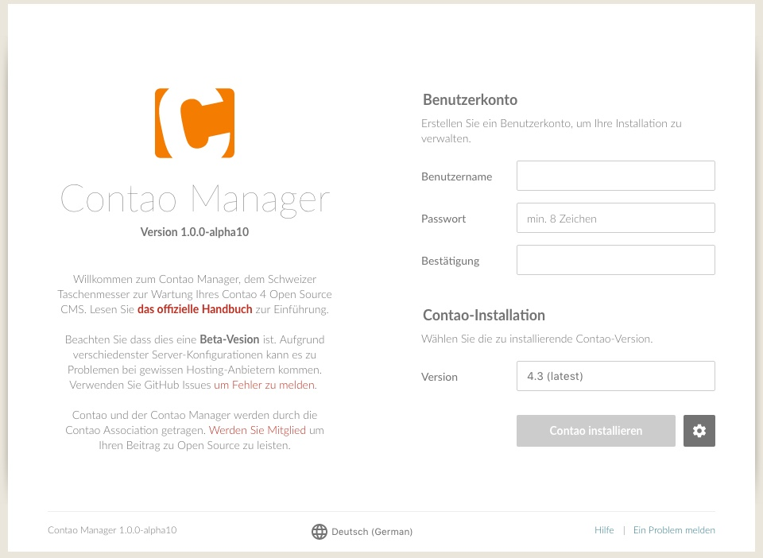
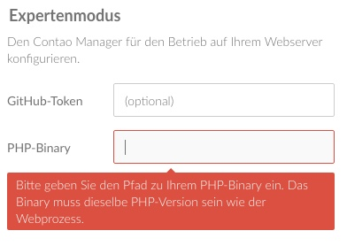

# Contao Manager installieren

## Systemvoraussetzungen

Die Voraussetzungen entsprechen grundsätzlich denen von Contao 4. Der
Contao Manager prüft automatisch, ob die Anforderungen erfüllt sind.

 - PHP Version 5.5.9 oder neuer
 - PHP Erweiterung *Intl* und *OpenSSL*
 - PHP Funktionen *proc_open* und *proc_close*
 - PHP Einstellung *allow_url_fopen* muss aktiv sein

> #### info:: Hinweis
> Der Contao Manager kann zur Zeit auf Windows-Servern nicht verwendet werden.

## Hosting-Konfiguration

In Contao 4 befinden sich alle öffentlich erreichbaren Dateien in einem
Unterorder `/web` der Installation. Erstellen Sie dazu den Ordner `web`
und setzen Sie das Wurzelverzeichnis (Document Root) der Installation auf
diesen Unterordner (z.B. über das Admin-Panel des Hosting-Providers).

**Beispiel:** example.com zeigt auf das Verzeichnis */www/example/web*

> #### info:: Hinweis
> Pro Contao-Installation wird deshalb eine eigene (Sub)Domain benötigt.

## Download & Installation

Der Contao Manager besteht aus einer einzelnen Datei, welche über
[contao.org][1] heruntergeladen werden kann. Nach erfolgreichem Download
erhalten Sie eine Datei `contao-manager.phar`. Übertragen Sie diese
Datei in das Verzeichnis `web` auf ihrem Webserver.

> #### warning:: Vorsicht
> `.phar`-Dateien werden nicht von allen Hosting-Anbietern ausgeführt.
> Für beste Kompatibilität fügen Sie die Dateiendung `.php` hinzu
> (Finaler Dateiname: `contao-manager.phar.php`).

<!-- Quote break -->

> #### danger:: Achtung
> `.php`-Dateien werden von den meisten FTP-Programmen im Text- statt
> Binär-Modus übertragen, was die Manager-Datei zerstört. Fügen Sie die
> Dateiendung `.php` erst nach dem Upload hinzu.

### Contao Manager aufrufen

Anschließend rufen Sie mit Ihrem Browser die URL
`http://www.example.com/contao-manager.phar.php` auf.
Sie sollten nun den Willkommen-Screen des Contao Managers sehen.

## Grundkonfiguration

Bevor Sie nun Contao installieren, muss der Manager selbst konfiguriert werden.
Legen Sie dazu einen neuen Benutzer an, indem Sie einen Benutzernamen und ein
Passwort vergeben.
Das Passwort ist unabhängig von der späteren Contao Installation. Bitte notieren
Sie sich die Zugangsdaten.

Der Contao Manager benötigt keine eigene Datenbank.
Die Konfiguration wird in mehreren Dateinen im Unterordner `contao-manager`
gespeichert.

## PHP binary - Experten Einstellungen

Der Contao Manager versucht automatisch den PHP-Pfad zu erkennen.
Leider ist das nicht immer möglich, deswegen sollten Sie die Einstellung noch
einmal prüfen.

Wenn bereits eine Version erkannt wurde, müssten Sie zuerst auf das
"Zahnradsymbol" neben dem "Install-Button" klicken, damit die Einstellung
sichtbar wird.

Nun können Sie die [Contao Installation](installation-contao.md) starten

[1]: https://contao.org/de/download.html
