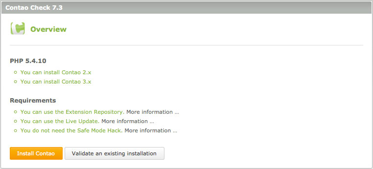

## 稼働中のサーバーの設定

この章はApacheのインストールやPHPのコンパイルといった、共有ホスティングサービスのアカウントではどうにも不可能なことについてではありません。Contaoのシステム要件に合っているかどうかの確認と、PHP 5を有効にする方法を説明します。

### Contaoのシステム要件

ContaoにはPHPとMySQLをサポートしている、ApacheやIISのようなウェブサーバーが必要です。PHPの最小のバージョンは5.3.2、MySQLの最小のバージョンは5.0です。
また、PHPのGDlib拡張(画像の大きさの変更)、"DOM"(XMLファイル)、SOAP拡張(機能拡張リポジトリ)も必要で、さらにmbstring(マルチバイト文字の処理)とmcrypt(データの暗号化)も追加で必要な場合があります。Contaoはすべての主要なブラウザー、Firefox(バージョン2以降)やInternet Explore(バージョン8以降)で正しく動作するテストをしています。

### Contaoチェック

サーバーがContaoのシステム要件を満たしているかどうかは、Contaoチェックをダウンロードして調べてください。Contaoチェックは機能拡張リポジトリとライブアップデートを利用できるかどうかと、セーフモード対処が必要かどうかを検査します。システムの構成に依存しますが、新しいContaoをインストールツールでインストールのための設定や、既にインストールしているContaoの検証を行えます。

Zipファイルを展開して、Contaoをインストールしているディレクトリに`check`という名前のフォルダーにアップロードして、それをWebブラウザーで開いてください。

[Contaoチェックをダウンロード][1] | [GitHubのプロジェクトを開く][2]

### ISPに特有の設定

Contaoを動作させるのに少し余分な設定が必要となる、主要なインターネットサービスプロバイダー(ISP)があります。幸い、そのようなISPは例外と言えます。ISPに特有の設定は[Contaoのフォーラム][3]に説明があります。手間のかからないContaoのホスティングを探されている場合は、[Contaoのホスティングパートナー][4]のリストを調べてください。

[1]: https://github.com/contao/check/zipball/master
[2]: https://github.com/contao/check
[3]: https://community.contao.org/en/
[4]: https://contao.org/en/partners.html?search=services&for=partner_hosting
