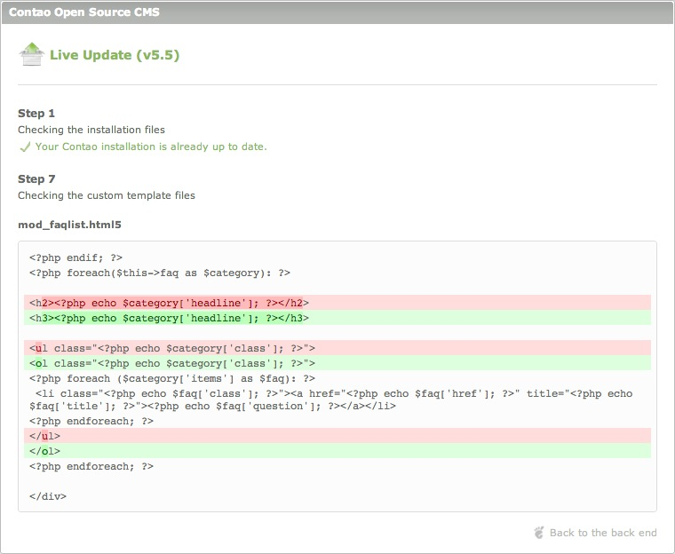

## ライブアップデートサービス

Contaoライブアップデートサービスは商用のContaoの追加機能で、Contaoの創始者で中心的な開発者であるLeo Feyer氏の[iNet Robots社][1]が提供しています。ライブアップデートサービスを利用すると、バックエンドで数回のクリックでインストールしているContaoを更新でき、ContaoのアーカイブをダウンロードやFTPプログラムでファイルの置き換えや同期を行う必要もありません。

[ライブアップデートサービスに申し込み][2]

ライブアップデートサービスには以下の特徴があります:

* 任意のバージョンのContaoへアップグレードとダウングレード
* アップデートの前の自動的なデータベースのバックアップ
* インストールしているContaoの個別の検証と完成
* カスタマイズしたテンプレートと元のファイルの比較

### バージョンの選択

### テンプレートの違い

### トラブルシューティング

ライブアップデートのすべての問題の99%は、誤ったファイルの権限によります。Contaoはファイルとフォルダーを管理するために書き込み権限を必要としますので、ライブアップデートが適切に動作しない場合はサーバーの設定を確認し、**このユーザーガイドで説明しているように**セーフモード対処を設定していることを確認してください。

#### サポートの受け方

ライブアップデートIDの起動やアップデートのアーカイブの受信に問題がある場合は、[iNet Robots社][6]に連絡してください。セーフモード対処やContaoの使用に問題がある場合は、[サポートのページ][7]にあるサポートの選択肢を選択してください。

[1]: http://www.inetrobots.com
[2]: https://update.contao.org/
[3]: https://update.contao.org/en/support.html
[4]: https://contao.org/en/support.html
