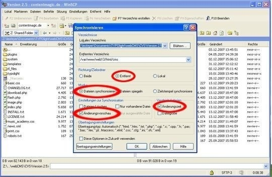
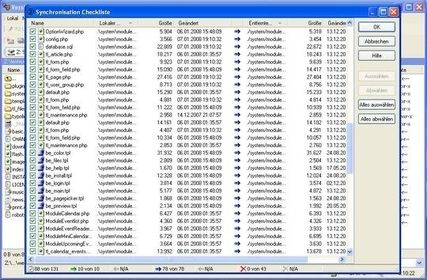

## 手作業による更新

インストールしているContaoを手作業で更新するときは、Contaoのダウンロードしたアーカイブ全体をサーバーにアップロード(ファイルをの置き換え)をするか、最後の更新から変更されたファイルだけをアップロード(ファイルの同期)を行います。いずれの場合でも、エラーや誤って上書きした場合のため、以下のファイルとフォルダーを常にバックアップすべきです。

* `files/*`
* `system/config/dcaconfig.php`
* `system/config/initconfig.php`
* `system/config/langconfig.php`
* `system/config/localconfig.php`
* `system/config/pathconfig.php`
* `templates/*`

これであなたのContaoの構成、カスタマイズしたテンプレート、ファイルをバックアップしたことになります。

### ファイルの置き換え

インストールしているContaoのファイルの置き換えは極めて単純です。Contaoのダウンロードしたアーカイブを単にサーバー上で展開するか、ローカルのコンピューター上で展開してFTPクライアントでファイルをアップロードしてください。そしてバックアップしたファイルを復元して、前のContaoのバージョンの残りのファイルがあれば削除してください。

**注意**: 第三者の機能拡張をインストールしている場合は、それらのバックアップと復元も忘れずに行うようにするか、完全に上書きしないようにしてください。そうしないと、モジュールを再インストールしなければならなくなり、機能拡張によってはデータを結果的に失うこともあるからです!

Composerクライアントで機能拡張を管理している場合は、ルートディレクトリにある`/composer`もバックアップしなければなりません。

### ファイルの同期

インストールしているContaoの同期をするには、[Unixのdiffユーティリティ][1]かFTPプログラムのどちらかを使用できます。Unixのユーティリティーは一般にサーバーの管理者だけが使用するため、ここでは説明しません。ファイルをFTPで同期するには、WinSCPを実行してサーバーに接続してください。上記で述べたファイルをバックアップしてから、Contaoのディレクトリを指定して、「ファイルの同期(Synchronize files)」のボタンをクリックしてください。

オプションを注意深く見直してから「変更のプレビュー("Preview changes")」を選択すると、更新されるファイルを確認できます。それから、それぞれのファイルをプレビューウィンドウで確認し、削除すると印のついたファイルは二重にチェックしてください!  "OK"をクリックすると同期の処理を開始します。

### データベースの更新

Contaoのファイルを更新した後は、データベースも更新しなければなりません。幸いなことに、Contaoのインストールツールが殆どの作業を行ってくれます。Contaoのインストールツールを開いてパスワードを入力して、データベースのセクションまでページをスクロールして、変更内容を確認してください。

### 内部キャッシュの消去

最後に、(DCAと言語ファイルの)内部キャッシュも再構築しなければなりません。バックエンドの「保守」をアクセスして「データを消去」の部分にある「内部キャッシュを消去」を選択してください。「データを消去」をクリックして実行してください。

するとヘッダーに内部キャッシュを再構築する確認を求めるメッセージを表示します。「キャッシュを作成」をクリックして内部のファイルをキャッシュを作成してください。

[1]: http://en.wikipedia.org/wiki/Diff
