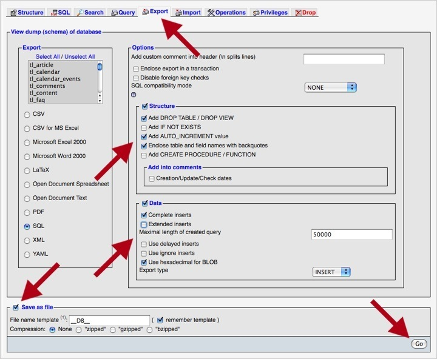
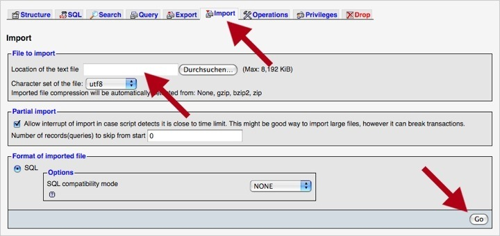

## Contaoの移設

インストールしているContaoをローカルのサーバーから稼働中のサーバーに移設するのは、新しいContaoのバージョンをインストールするのに比べてあまり違いはありません。違いはダウンロードしたContaoのアーカイブの代わりにローカルにインストールしているファイルの使用することと、ローカルのデータベースのSQLのダンプを使用することです。

### ファイルのアップロード

FTPプログラムを起動して、対象とするサーバーに接続してローカルにインストールしているContaoからファイルをすべてアップロードしてください。

### データベースのエクスポート

もっとも簡単にMySQLのdumpを作成する方法は、データベースの管理ツール"phpMyAdmin"の使用です。サーバーの管理者の場合は、もちろん`mysqldump`ユーティリティも使用できます。"phpMyAdmin"にログインして、エクスポートしたいデータベースを選択して、トップメニューの"エクスポート(Export)"のタブをクリックしてください。MySQLのバージョンの互換性の問題を最小とするため、以下の画面の例のようにエクスポートの設定を調整することが重要です。

### データベースのインポート

移設先のサーバーに"phpMyAdmin"でログインしてContao用の新しいデータベースを作成します。サーバーの設定によっては、(例えばPleskやcPanelといった)サーバーの管理パネルをデータベースの作成に使用する必要があるでしょう。空のデータベースを選択して、トップメニューの"インポート(Import)"のタブをクリックしてください。それからローカルのデータベースのSQLのダンプをアップロードしてインポートを開始してください

### データベースの設定の調整

最後に、新しいインストールでContaoのインストールツールを実行して(パスワードはローカルにインストールしていたのと同じはず)、必要な場合はデータベースの設定を調整してください。そしてバックエンドに移動して、あなたのユーザー名とパスワードでログインしてください。
