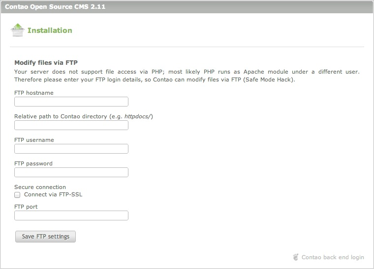

## セーフモード対処の使用

Contaoをインストールツールでインストールしようとすると、ローカルの構成ファイルに書き込めないという警告が表示されるかもしれません。

### ファイルの権限の問題

「セーフモード対処」という用語は実際には語弊があります、というのもPHPの`safe_mode`によって起きる問題と暗に示すからです。しかし、実際はファイルへの不十分な権限によって発生して、`safe_mode`が無効でも起きる場合があります。代わりに「ファイルアクセス権限対処」とでも呼ぶべきでしょう。ApacheのモジュールによるPHPは一般に`wwwrun`、`www-data`、`nobody`といったユーザーで動作するのに対して、FTPでアップロードしたファイルはあなた(`web4`や`ab5678`といったユーザー)が所有者となります。このような状況だと、サーバーはこれらのファイルにPHPスクリプトからのアクセスを許可しません。

#### ファイルの操作にFTPを使用

この権限の問題に対処するために、ContaoはFTP接続を行ってファイルとフォルダーを変更します。このために必要なのはFTPのログインの詳細を入力するだけです。FTPのルートディレクトリからContaoのフォルダー(例えば`html/`、`public_html/`、`httpdocs/`)への相対パスを入力するときは特に注意してください。

PHPが直接アクセスするため、いくつかのディレクトリはさらに書き込みの権限が必要です:

* `assets/images`
* `assets/images/*`
* `system/logs`
* `system/tmp`

インストールツールは権限(CHMOD 777)を自動的に設定するので、通常は手作業で調整する必要はありません。万が一必要な場合は、**上に示した3つのディレクトリだけ調整して**ください。例え入門書やContaoのフォーラムにどのように書かれていたとしても!
