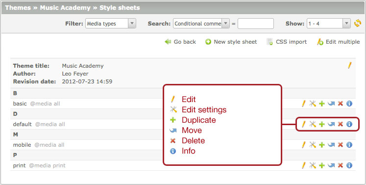
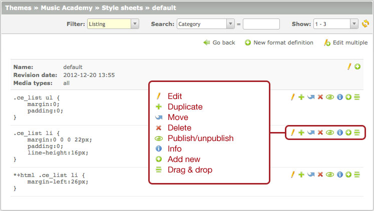
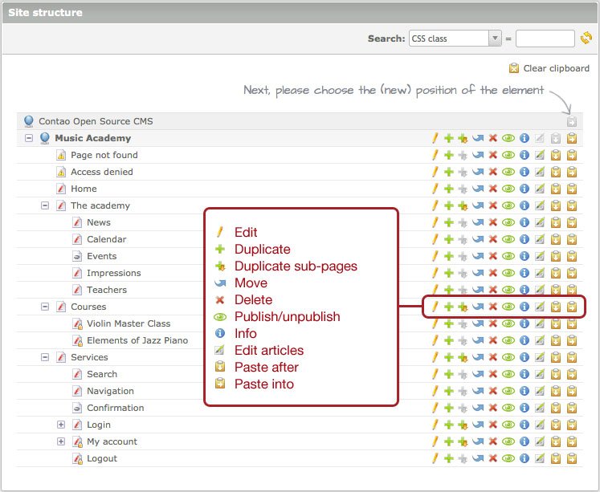
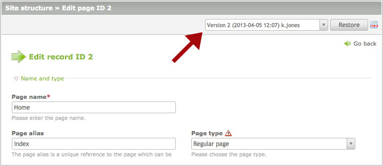
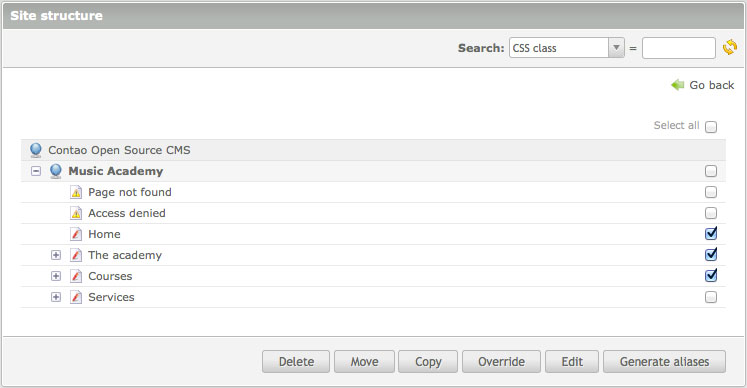
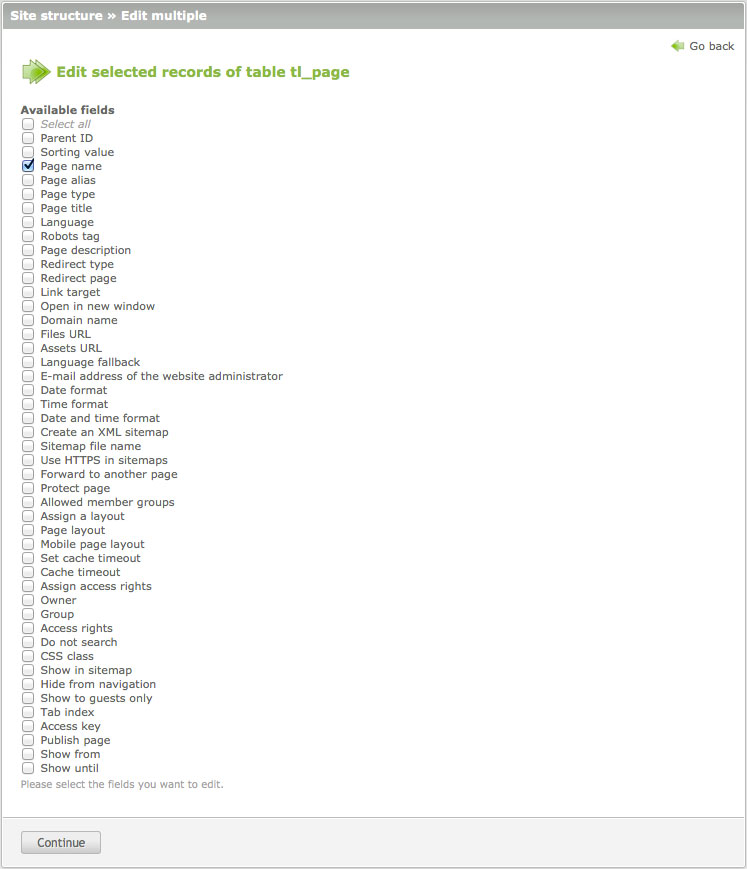
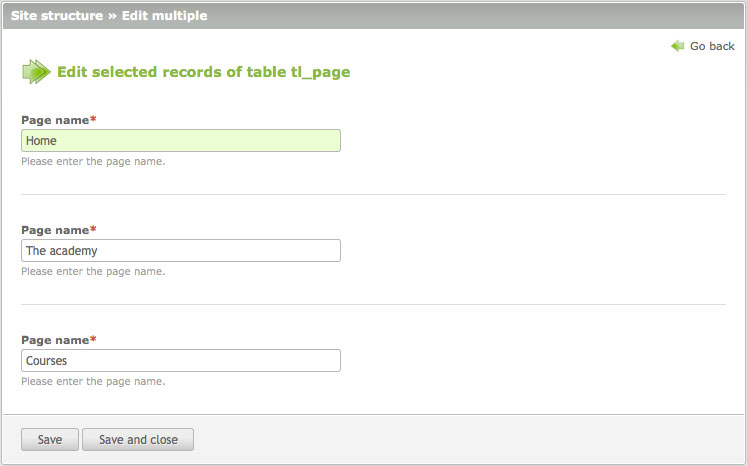

## レコードの編集

データの編集はコンテンツ管理システムの中心的な機能の1つです。Contaoは編集の作業を可能な限り容易と快適にする多くの専門的な機能を用意しています。レコードの前のバージョンに戻したり、削除したレコードを復元したり、クリップボードを経由して移動したり、同時に複数のレコードを編集したりといったことさえ可能です。これらの機能の殆どはナビゲーションのアイコンを使用して実行できます。

### リスト表示のアイコン

「リスト表示」はもっとも単純な表示形式で、4つの基本的な処理: 編集、複製、削除、表示を用意しています。

### ペアレント表示のアイコン

「ペアレント表示」はナビゲーションのアイコンを2つの追加していて、レコードの順序を制御できます。順序はドラッグアンドドロップでも変更できます。これはナビゲーションのアイコン「ドラッグアンドドロップ」をクリックしてから、新しい位置にドラッグすることで行えます。

### ツリー表示のアイコン

「ツリー表示」に必要なのは階層構造を扱うための追加のアイコンです。1つのレコードの複製に加えて、すべての下位のレコードを含めた複製、レコードの後や中に貼り付けを提供していて、入れ子となった構造を作成できるようにしています。

### 以前のバージョンの復元

Contaoはレコードを保存するときに、その新しいバージョンを毎回自動的に作成しています。複数のバージョンが存在していると、フォームの上部にドロップダウンメニューを表示して、ここから以前のバージョンに戻すことができます。単純にバージョンを選択して「復元」のボタンをクリックします。

「復元」のボタンの右にあるアイコンで、2つのバージョンの間の違いを表示できます。

### 複数のレコードの編集

一度に複数のレコードを編集する能力は、Contaoを様々なコンテンツ管理システムから明らかに際立たせています。「複数を変更」のボタンをクリックすると編集モードが切り替わるので、1つ以上の変更したいレコードを選択して、それから修正したい項目を選択してください。

