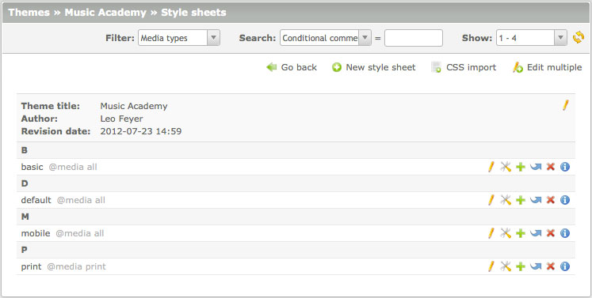
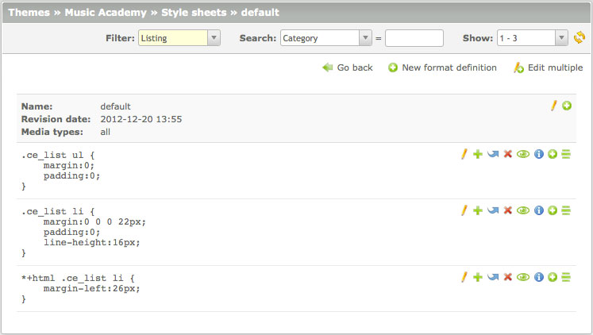
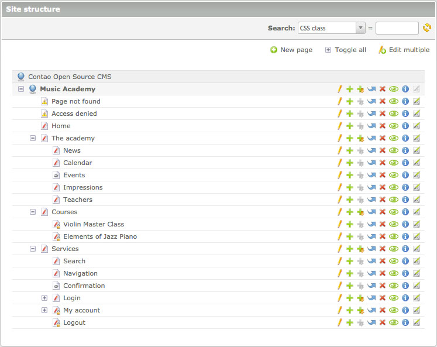
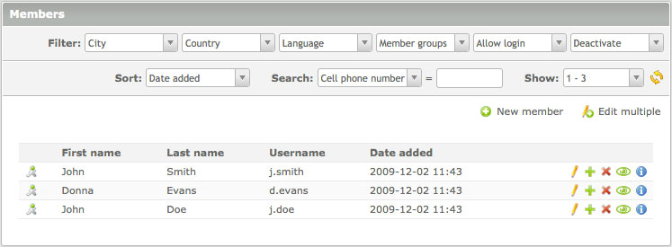

## レコードの一覧

Contaoのコアのエンジンは3つの表示方法をサポートしています: 単純な一覧("リスト表示")、親のテーブルでグループ化した一覧("ペアレント表示")、階層的な一覧("ツリー表示")です。これらの3つの表示を任意のテーブルや関連するテーブルの一覧に使えます。

### リスト表示

"リスト表示"は単一のテーブルのレコードを特定の順序で一覧表示します。その結果は通常は最初の文字でグループにまとめられます。

### ペアレント表示

"ペアレント表示"は親のテーブルの特定のレコードに関連した、子のテーブルのレコードを一覧表示します。親と子の関係はContaoで多数使用していて、例えばアーティクルとコンテント要素、ニュースアーカイブとニュース記事、スタイルシートと書式定義などです。

### ツリー表示

"ツリー表示"は、ファイルとフォルダーのように階層的な構造を構成する、レコードとその他のリソースを表示します。Contaoは単一の階層的なテーブル(例えば、サイト構造)に加えて、階層的な親のテーブルと関連した子のテーブル(例えば、アーティクルとページ)もサポートしています。

### 並べ替えとデータのフィルター

Contaoには様々な結果を絞り込む方法をサポートしていて、例えテーブルが数千の列でも状況の把握ができなくなるようなことはありません。多くの一覧表示は1つ以上の項目でフィルターして、その条件に合ったレコードだけを表示できます。加えて殆どの一覧表示では、正規表現までサポートした全文検索も提供しています。ページを表示する時間を最小限とするため、Contaoは一度には30レコードだけ表示します。

