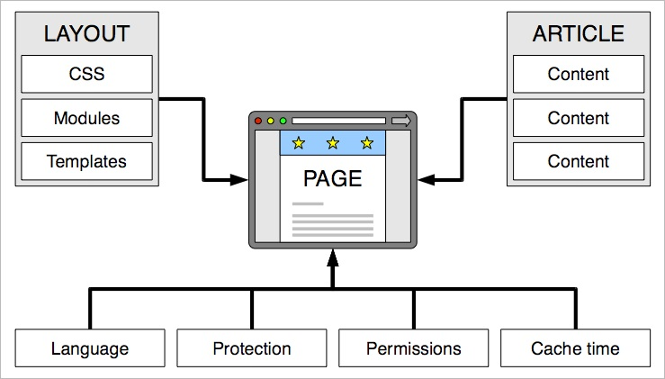

## 構成要素

ページ、アーティクル、コンテント要素、モジュールが互いの関連の理解が、Contaoを学ぶための鍵となります。前に述べましたように、サイト構造はウェブサイトの中心的な要素です。ウェブサイトの訪問者は常にページをリクエストし、ノードを基盤としたCMSのようにアーティクルをリクエストするのではありません。

アーティクルとレイアウトの2つが、もっとも重要なページの要素であることを略図は示しています。アーティクルがページのコンテンツを保持する一方、ページレイアウトはウェブサイトにどのように表示するかを定めています。ContaoのレイアウトはCSSに基づいていて、もちろん表を使用したレイアウトではありません。続く章では、スタイルシートとモジュールの作成方法、それらのページレイアウトへの結合方法、ページレイアウトを使用するページの作成方法について説明します。
