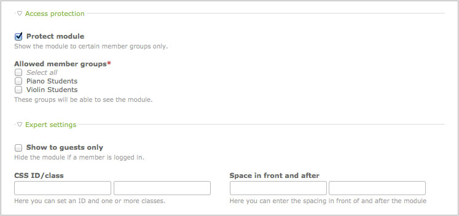

## モジュール

フロントエンドモジュールは、ウェブサイトに殆どどのような種類の機能でも追加できます。Contaoのコアは様々なナビゲーションメニューの生成、ユーザーの登録と認証、ウェブサイトの検索、RSSフィードの取り込み、さらに様々なモジュールを含んでいます。モジュールを作成するには、バックエンドにログインして、ナビゲーションメニューから「テーマ」→「フロントエンドモジュール」と選択してください。

<table>
<tr>
  <th>モジュール</th>
  <th>CSSのクラス</th>
  <th>説明</th>
</tr>
<tr>
  <td>ナビゲーションメニュー</td>
  <td>mod_navigation</td>
  <td>サイト構造に基づいたナビゲーションのメニューを生成します。</td>
</tr>
<tr>
  <td>カスタムナビゲーション</td>
  <td>mod_customnav</td>
  <td>独自のナビゲーションのメニューを生成します。</td>
</tr>
<tr>
  <td>パンくずナビゲーション</td>
  <td>mod_breadcrumb</td>
  <td>パンくずナビゲーションのメニューを生成します。</td>
</tr>
<tr>
  <td>クイックナビゲーション</td>
  <td>mod_quicknav</td>
  <td>サイト構造に基づいたドロップダウンメニューを生成します。</td>
</tr>
<tr>
  <td>クイックリンク</td>
  <td>mod_quicklink</td>
  <td>独自ののドロップダウンメニューを生成します。</td>
</tr>
<tr>
  <td>ブックナビゲーション</td>
  <td>mod_booknav</td>
  <td>ブックのナビゲーションメニューを生成します。</td>
</tr>
<tr>
  <td>アーティクルナビゲーション</td>
  <td>mod_article_nav</td>
  <td>アーティクルをナビゲートするページネーションのメニューを生成します。</td>
</tr>
<tr>
  <td>サイトマップ</td>
  <td>mod_sitemap</td>
  <td>サイト構造のすべてのページの一覧を生成します。</td>
</tr>
<tr>
  <td>ログインフォーム</td>
  <td>mod_login</td>
  <td>ログインのフォームを生成します。</td>
</tr>
<tr>
  <td>自動ログアウト</td>
  <td>-</td>
  <td>ユーザーを自動的にログアウトします。</td>
</tr>
<tr>
  <td>個人データ</td>
  <td>mod_personalData</td>
  <td>ユーザーの個人データを編集するフォームを生成します。</td>
</tr>
<tr>
  <td>登録</td>
  <td>mod_registration</td>
  <td>ユーザーの登録フォームを生成します。</td>
</tr>
<tr>
  <td>パスワードの変更</td>
  <td>mod_changePassword</td>
  <td>パスワードを変更するフォームを生成します。</td>
</tr>
<tr>
  <td>パスワードの紛失</td>
  <td>mod_password</td>
  <td>新しいパスワードを要求するフォームを生成します。</td>
</tr>
<tr>
  <td>アカウントの廃止</td>
  <td>mod_closeAccount</td>
  <td>メンバーのアカウントを削除するフォームを生成します。</td>
</tr>
<tr>
  <td>ニュースリスト</td>
  <td>mod_newslist</td>
  <td>ニュース項目のリストをページに追加します。</td>
</tr>
<tr>
  <td>ニュースリーダー</td>
  <td>mod_newsreader</td>
  <td>ニュース項目の詳細を表示します。</td>
</tr>
<tr>
  <td>ニュースアーカイブ</td>
  <td>mod_newsarchive</td>
  <td>ニュースアーカイブをページに追加します。</td>
</tr>
<tr>
  <td>ニュースアーカイブメニュー</td>
  <td>mod_newsmenu</td>
  <td>ニュースアーカイブを閲覧するナビゲーションのメニューを生成します。</td>
</tr>
<tr>
  <td>カレンダー</td>
  <td>mod_calendar</td>
  <td>カレンダーをページに追加します。</td>
</tr>
<tr>
  <td>イベントリーダー</td>
  <td>mod_eventreader</td>
  <td>イベントの詳細を表示します。</td>
</tr>
<tr>
  <td>イベントリスト</td>
  <td>mod_eventlist</td>
  <td>イベントのリストをページに追加します。</td>
</tr>
<tr>
  <td>イベントリストメニュー</td>
  <td>mod_eventmenu</td>
  <td>イベントのリストを閲覧するナビゲーションのメニューを生成します。</td>
</tr>
<tr>
  <td>登録の申し込み</td>
  <td>mod_subscribe</td>
  <td>1つ以上のチャンネルの登録を申し込みできるフォームを生成します。</td>
</tr>
<tr>
  <td>解除の申し込み</td>
  <td>mod_unsubscribe</td>
  <td>1つ以上のチャンネルの解除を申し込みできるフォームを生成します。</td>
</tr>
<tr>
  <td>ニュースレターリスト</td>
  <td>mod_nl_list</td>
  <td>ニュースレターのリストをページに追加します。</td>
</tr>
<tr>
  <td>ニュースレターリーダー</td>
  <td>mod_nl_reader</td>
  <td>ニュースレターの詳細を表示します。</td>
</tr>
<tr>
  <td>FAQリスト</td>
  <td>mod_faqlist</td>
  <td>よくある質問のリストをページに追加します。</td>
</tr>
<tr>
  <td>FAQリーダー</td>
  <td>mod_faqreader</td>
  <td>よくある質問の回答を表示します。</td>
</tr>
<tr>
  <td>FAQページ</td>
  <td>mod_faqpage</td>
  <td>FAQリストとFAQリーダーを同一のページで表示します。</td>
</tr>
<tr>
  <td>フォーム</td>
  <td>mod_form</td>
  <td>フォームをページに追加します。</td>
</tr>
<tr>
  <td>検索エンジン</td>
  <td>mod_search</td>
  <td>検索フォームをページに追加します。</td>
</tr>
<tr>
  <td>コメント</td>
  <td>mod_comments</td>
  <td>コメントのフォームをページに追加します。</td>
</tr>
<tr>
  <td>リスティング</td>
  <td>mod_listing</td>
  <td>テーブルのレコードを一覧します。</td>
</tr>
<tr>
  <td>Flash動画</td>
  <td>mod_flash</td>
  <td>Flash動画をページに埋め込みます。</td>
</tr>
<tr>
  <td>アーティクルリスト</td>
  <td>mod_article_list</td>
  <td>一列のアーティルクの一覧を生成します。</td>
</tr>
<tr>
  <td>ランダムな画像</td>
  <td>mod_random_image</td>
  <td>無作為に選択した画像をページに追加します。</td>
</tr>
<tr>
  <td>カスタムHTML</td>
  <td>-</td>
  <td>独自のHTMLコードを追加します。</td>
</tr>
<tr>
  <td>RSSリーダー</td>
  <td>mod_rss_reader</td>
  <td>RSSフィードをページに追加します。</td>
</tr>
</table>

### アクセス制御

それぞれのフロントエンドモジュールは保護してウェブサイドでゲストだけ、または特定のグループのメンバーだけに表示するようにできます。

