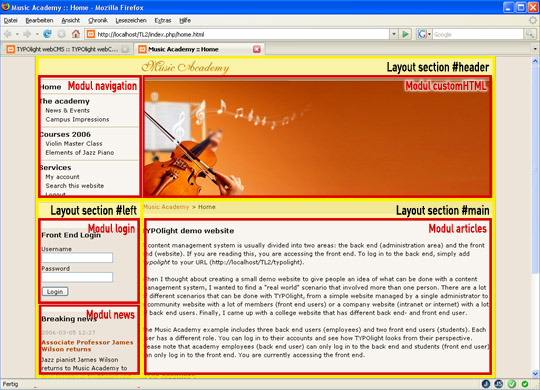
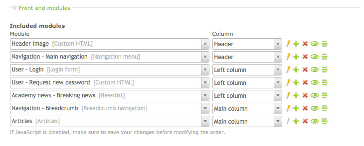

## ページレイアウト

ページレイアウトは例えば列の数や全体の幅といった基本的なページの設定と、それぞれの列にどのフロントエンドモジュールを表示するか定めます。また、ページに含めるスタイルシート、RSSやATOMのフィードのリンク、GoogleアナリティクスのIDの関連付け、対話的な要素とプラグインに必要な任意のJavaScriptのコードを追加できます。ContaoのCSSのフレームワークはブラウザーのウィンドウを自動的にいくつかのレイアウトセクションに分割して、次の図のようにそれぞれのセクションに割り当てたモジュールを下図のように表示します。

これは、ページレイアウトを作成するまでに含めるすべてのスタイルシートとフロントエンドモジュールを作成が必要なことを意味します。従って、以下の順序でリソースを作成することをお勧めします:

* 必要なフロントエンドモジュールの作成
* 必要なスタイルシートの作成
* ニュースアーカイブやカレンダーが必要であれば作成
* 新しいページレイアウトを作成して、これらの構成要素を結合
