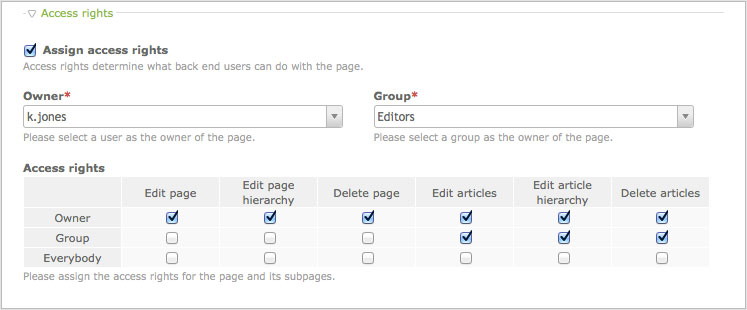

## ページの種類

ページの種類はコンテンツを表示する、他のページに移動する、ページツリー内で新しいウェブサイトの開始点を定義する、ページの動作を決定します。Contaoは以下に説明する、6つの異なったページの種類をサポートしています。

<table>
<tr>
  <th>ページの種類</th>
  <th>説明</th>
</tr>
<tr>
  <td>通常ページ page</td>
  <td>通常ページはアーティクルとコンテント要素を含みます。静的なHTMLのページのように振る舞います。</td>
</tr>
<tr>
  <td>外部リダイレクト</td>
  <td>この種類のページは外部のウェブサイトに自動的にリダイレクトします。ハイパーリンクのように動作します。</td>
</tr>
<tr>
  <td>内部リダイレクト</td>
  <td>この種類のページはサイト構造の中の他のページに自動的に移動します。</td>
</tr>
<tr>
  <td>ウェブサイトのルート</td>
  <td>この種類のページはページ構造内で新しいウェブサイトを開始する点を示します。</td>
</tr>
<tr>
  <td>403 アクセスの拒否</td>
  <td>ユーザーが権限を持たない保護されたページを要求した場合に、403のエラーページを代わりに読み込みます。このページはウェブサイトのルートの<b>直下</b>に追加しなければなりません。</td>
</tr>
<tr>
  <td>404 存在しないページ</td>
  <td>ユーザーが存在しないページを要求した場合に、404のエラーページを代わりに読み込みます。このページはウェブサイトのルートの<b>直下</b>に追加しなければなりません。</td>
</tr>
</table>

### 複数ドメインのモード

Contaoは複数のウェブサイトをサイト構造でサポートしていて、訪問者をDNSと言語の設定に応じた特定のウェブサイトのルートに自動的に移動します。"www.example.com"というドメインを使用している二か国語の企業のウェブサイトと、"www.personal.example.org"というドメインを使用している小規模の個人的なウェブサイトを運営しているとした場合を仮定しましょう。この場合は3つのウェブサイトのルートが必要です:

<table>
<tr>
  <th>種類</th>
  <th>DNS</th>
  <th>言語コード</th>
  <th>代替の言語</th>
</tr>
<tr>
  <td>ドイツ語版の企業のサイトの</td>
  <td>なし</td>
  <td>de</td>
  <td>いいえ</td>
</tr>
<tr>
  <td>英語版の企業のサイト</td>
  <td>なし</td>
  <td>en</td>
  <td>はい</td>
</tr>
<tr>
  <td>個人のウェブサイト</td>
  <td>www.personal.example.org</td>
  <td>de</td>
  <td>はい</td>
</tr>
</table>

次の表は、ドメインとアクセスするブラウザーの言語に対応して表示するページを示します。

<table>
<tr>
  <th>ドメイン</th>
  <th>ブラウザーの言語</th>
  <th>表示先</th>
</tr>
<tr>
  <td>www.example.com</td>
  <td>英語</td>
  <td>英語版の企業のサイト</td>
</tr>
<tr>
  <td>www.example.com</td>
  <td>ドイツ語</td>
  <td>ドイツ語版の企業のサイト</td>
</tr>
<tr>
  <td>www.example.com</td>
  <td>スペイン語</td>
  <td>英語版の企業のサイト</td>
</tr>
<tr>
  <td>www.personal.example.org</td>
  <td>どれでも</td>
  <td>個人のウェブサイト</td>
</tr>
</table>

「言語の代替」のオプションを有効にしていないと、個人のウェブサイトはドイツ語を話すユーザーだけしか利用できないことに注意してください!

### アクセス権

アクセス権はバックエンドのユーザーがページとそのアーティクルに行えることを定義します。特定のフロントエンドのユーザだけがアクセスできる保護されたページとは無関係です! Unixのファイルの権限システムと同様に、3つの権限レベルがあります:

* ページの所有者としてアクセス
* ページを所有するグループのメンバーとしてアクセス
* 特別な権限のないユーザーとしてアクセス

それぞれのレベルに異なる権限を設定できます。初期状態では、ページの所有者はページ自身とそのアーティクルを編集でき、ページを所有するグループのユーザーはアーティクルだけを編集でき、特別な権限のないユーザーは書き込み権限を一切持ちません。

