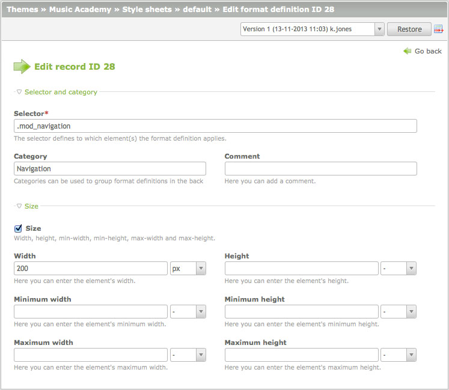

## スタイルシート

アクセスしやすいウェブサイトは常にCSSを使用して形を作らなければなりません。これがContaoがバックエンドで書式定義を管理する「スタイルシート」のモジュールを含めている理由です。様々なContaoの要素を参照するには、それらのclassの名前を知る必要があります。[コンテント要素のクラス][1]は(例えば、"ce\_text"といった)"ce\_"で始まり、[モジュールのクラス][2]は(例えば、"mod\_search"といった)"mod\_"で始まります。よくわからない場合は、単にページのソースを見てください。



それぞれのスタイルシートは1つまたは複数のメディアタイプと、Internet Exploreのバージョン(多数のバグの1つを修正が必要な場合)の両方またはどちらかに制限できます。書式定義の順序に注意してください、後の定義が前の書式定義を上書きするからです。

```css
/* 最初に一般的な値を設定 */
.mod_search {
    margin:24px;
}

/* それからIE7用の値を上書き */
*:first-child+html .mod_search {
    margin:18px;
}
```

もし順序が逆だと、一般的な値をIEに特定のマージンで上書きしてしまいます。


[1]: ../04-managing-content/articles.md#articles
[2]: ../03-managing-pages/modules.md#modules
