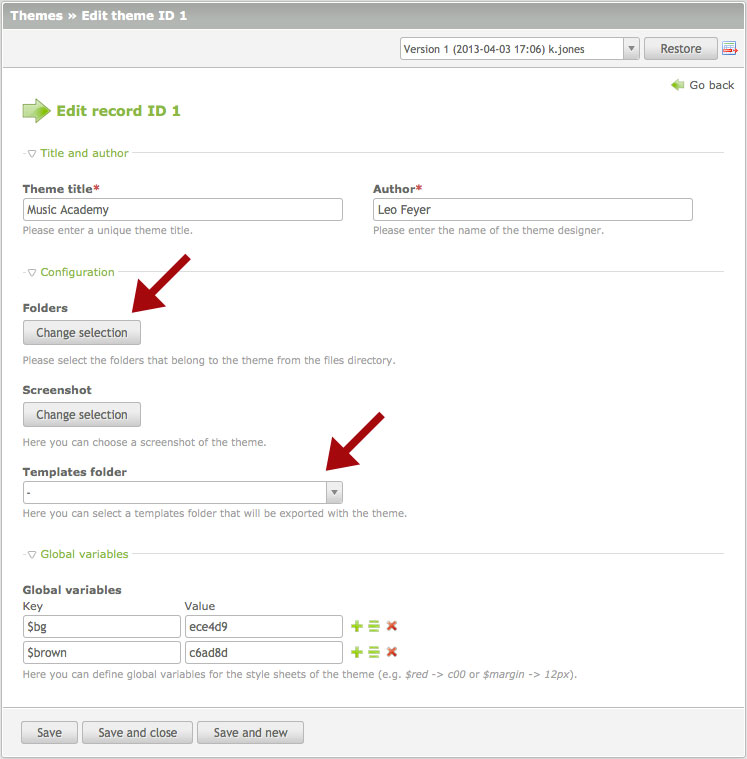

## テーマ

ウェブサイトのデザインは一般的にスタイルシート、フロントエンドモジュール、ページレイアウト、ファイル、テンプレートから構成されていて、これらをContaoのバックエンドで管理できます。テーマ管理は、このやり方をまったく変えずに、これらのリソースのインポートとエクスポートする選択肢を追加するだけです。

### テーマとフロントエンドテンプレートの違い

[テーマ][1]とフロントエンドテンプレートの主な違いは、フロントエンドテンプレートは完全に事前に設定されたウェブサイトで、サンプルのサイト構造、アーティクル、コンテント要素、さらにユーザーとグループも含んでいます。対照的に、テーマは実際のウェブサイトのデザインだけを含んでいて、そのため既存のデータを失わずにインポートできます。

### テーマの構成要素

テーマは[スタイルシート][2]、 [フロントエンドモジュール][3]、[ページレイアウト][4]のグループで、これらはすべてデータベースで保持していて、テーマのエクスポート機構が自動的に認識します。続く章で、これらの要素をさらに詳しく学習します。テーマはファイルディレクトリの画像とその他のファイルを通常は含んでいて、テンプレートのディレクトリのテンプレートを含む場合があります。しかし、これらのリソースはテーマに自動的に関連付けられず、このためエクスポートに含めるためにテーマの設定で追加しなければなりません。

### テーマのエクスポートとインポート

テーマをエクスポートするには、単にテーマのエクスポートのボタンをクリックして.ctoファイルを使用しているコンピューターにダウンロードしてください。.ctoはContaoのテーマのための独自の拡張子ですが、実際のファイルはZIPアーカイブで.zipファイルを扱える、どのプログラムでも展開できます。テーマを再インポートするには、.ctoファイルをインストールしたContaoにアップロードして、テーマ管理を開いて「テーマのインポート」をクリックしてください。複数のテーマを一度にインポートできます。インポートが完了した後で、サイト構造に新しいテーマのページレイアウトを割り当てられます。

[1]: https://contao.org/en/contao-themes-and-templates.html
[2]: ../03-managing-pages/style-sheets.md#style-sheets
[3]: ../03-managing-pages/modules.md#modules
[4]: ../03-managing-pages/page-layouts.md#page-layouts
