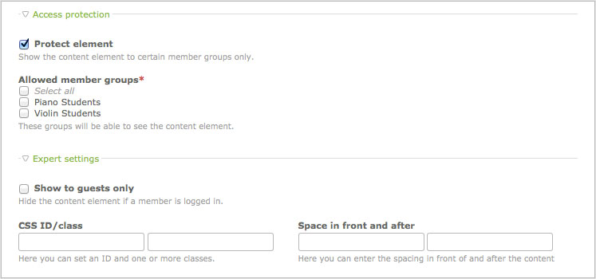

## アーティクル

アーティクルはコンテント要素の入れ物です。コンテント要素を一緒にグループ化して、
1つずつ扱う代わりに移動、公開、複製、編集、エクスポートを一度に簡単に行えます。それぞれのアーティクルは特定のページとレイアウトセクションに関連付けられているため、ウェブサイトとサイト構造の固定した位置となります。Contaoには「続きを読む」のリンクを付けたアーティクルのティーザーだけを表示するオプションがあります。

### コンテント要素

コンテント要素はコンテンツを作成する簡単で直感的な方法です。単にリッチテキストエディターを使用する代わりに、Contaoはコンテンツの種類に応じてテキスト、箇条書き、表、ハイパーリンク、画像、ダウンロードといった別々のコンテント要素を提供しています。Contaonのコアのコンテント要素の概要をここに示します:

<table>
<tr>
  <th>名前</th>
  <th>CSSのclass</th>
  <th>説明</th>
</tr>
<tr>
  <td>見出し</td>
  <td>ce_headline</td>
  <td>見出し(h1からh6)を生成します。</td>
</tr>
<tr>
  <td>テキスト</td>
  <td>ce_text</td>
  <td><a href="http://www.tinymce.com">TinyMCE</a>を使用して書式整形できるリッチテキストエディターを生成します。</td>
</tr>
<tr>
  <td>HTML</td>
  <td>-</td>
  <td>独自のHTMLコードを追加できます。</td>
</tr>
<tr>
  <td>箇条書き</td>
  <td>ce_list</td>
  <td>順序付き、または順序なしの箇条書きを生成します。</td>
</tr>
<tr>
  <td>表</td>
  <td>ce_table</td>
  <td>並べ替えも可能にできる表を生成します。</td>
</tr>
<tr>
  <td>コード</td>
  <td>ce_code</td>
  <td>コードの断片を強調表示して画面に表示します。</td>
</tr>
<tr>
  <td>Markdown</td>
  <td>ce_markdown</td>
  <td>MarkdownのテキストからHTMLのコードを生成します。</td>
</tr>
<tr>
  <td>アコーディオン(単一の要素)</td>
  <td>ce_accordion</td>
  <td>単一のアコーディオンの枠を(<a href="http://mootools.net">MooTools</a>で)生成します。</td>
</tr>
<tr>
  <td>アコーディオン(ラッパーの開始)</td>
  <td>ce_accordionStart</td>
  <td>アコーディオンの枠を開始する部分を生成します。</td>
</tr>
<tr>
  <td>アコーディオン(ラッパーの終了)</td>
  <td>-</td>
  <td>アコーディオンの枠を終了する部分を生成します。</td>
</tr>
<tr>
  <td>コンテントスライダー(ラッパーの開始)</td>
  <td>ce_sliderStart</td>
  <td>スライダーのラッパーを開始する部分を生成します。</td>
</tr>
<tr>
  <td>コンテントスライダー(ラッパーの終了)</td>
  <td>-</td>
  <td>スライダーのラッパーを終了する部分を生成します。</td>
</tr>
<tr>
  <td>ハイパーリンク</td>
  <td>ce_hyperlink</td>
  <td>他のウェブサイトへのリンクを生成します。</td>
</tr>
<tr>
  <td>トップリンク</td>
  <td>ce_toplink</td>
  <td>ページの先頭に移動するリンクを生成します。</td>
</tr>
<tr>
  <td>画像</td>
  <td>ce_image</td>
  <td>単体の画像を生成します。</td>
</tr>
<tr>
  <td>画像ギャラリー</td>
  <td>ce_gallery</td>
  <td><a href="http://www.digitalia.be/software/slimbox">lightbox</a>の画像ギャラリーを生成します。</td>
</tr>
<tr>
  <td>動画や音声</td>
  <td>ce_player</td>
  <td>動画や音声のプレーヤーを生成します。</td>
</tr>
<tr>
  <td>YouTube</td>
  <td>ce_youtube</td>
  <td>YouTubeの映像を追加します。</td>
</tr>
<tr>
  <td>ダウンロード</td>
  <td>ce_download</td>
  <td>単体のファイルをダウンロードするリンクを生成します。</td>
</tr>
<tr>
  <td>複数ダウンロード</td>
  <td>ce_downloads</td>
  <td>複数のファイルをダウンロードするリンクを生成します。</td>
</tr>
<tr>
  <td>アーティクル</td>
  <td>-</td>
  <td>他のアーティクルを取り込みます。</td>
</tr>
<tr>
  <td>コンテント要素</td>
  <td>(parent class)</td>
  <td>他のコンテント要素を取り込みます。</td>
</tr>
<tr>
  <td>フォーム</td>
  <td>ce_form</td>
  <td>フォームを取り込みます。</td>
</tr>
<tr>
  <td>モジュール</td>
  <td>(parent class)</td>
  <td>フロントエンドモジュールを取り込みます。</td>
</tr>
<tr>
  <td>アーティクルのティーザー</td>
  <td>ce_teaser</td>
  <td>アーティクルのティーザーを取り込みます。</td>
</tr>
<tr>
  <td>コメント</td>
  <td>ce_comments</td>
  <td>ページにコメントのフォームを追加します。</td>
</tr>
</table>


### アクセス制御

それぞれのコンテント要素を保護してウェブサイトではゲストだけ、または特定のグループのメンバーだけに表示するようにできます。




### Flashコンテンツ

Flashコンテンツは特殊な種類のコンテンツで、ウェブサイトのアーティクルに表示されずに動的にFlash動画を"loadVars()"を使用して読み込みます。ContaoとFlashの間の通信ができるように、以下の関数を動画のルートのフレームに追加しなければなりません。:

```as
TextField.prototype._loadArticle = function(flashID) {
  tf = this;

  // HTMLモードを有効にして、HTMLのコンテンツを削除
  tf.html = true;
  tf.htmlText = "";

  // 新しいLoadVarsオブジェクトを生成
  lv = new LoadVars();
  lv["flashID"] = flashID;
  lv.sendAndLoad(URL + "flash.php", lv, "POST");

  lv.onLoad = function(success) {
    if (success) {
      tf.htmlText = lv["content"];
    }
  }
}

// Flashのコンテンツ"myArticle"をテキスト項目の"myTextBox"に読み込み
myTextBox._loadArticle("myArticle");
```


#### スタイルシートのインポート

以下のActionScriptで、動的なテキストの項目を整形するスタイルシートをインポートできます:

```as
TextField.prototype._addCSS = function(style_sheet) {
  tf= this;
  tf.styleSheet = null;

  // 新しいStyleSheetオブジェクトのインスタンスを生成
  st = new TextField.StyleSheet();
  st.load(URL + style_sheet);

  st.onLoad = function(success) {
    if (success) {
      tf.styleSheet = st;
    }
  }
}

// スタイルシート"basic.css"をテキストボックス"myTextBox"に追加
myTextBox._addCSS("basic.css");
```

FlashはHTMLタグの少ない一部だけをサポートしているため、正しく表示されないスタイルもあることに注意してください。
