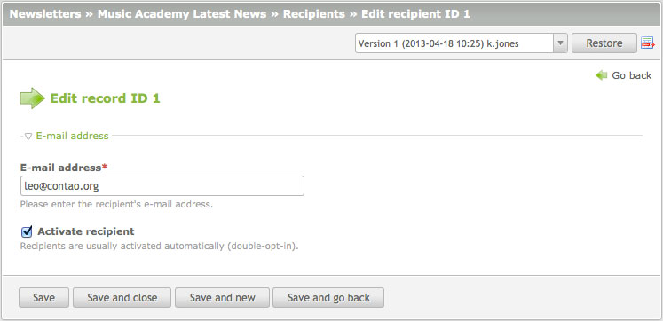
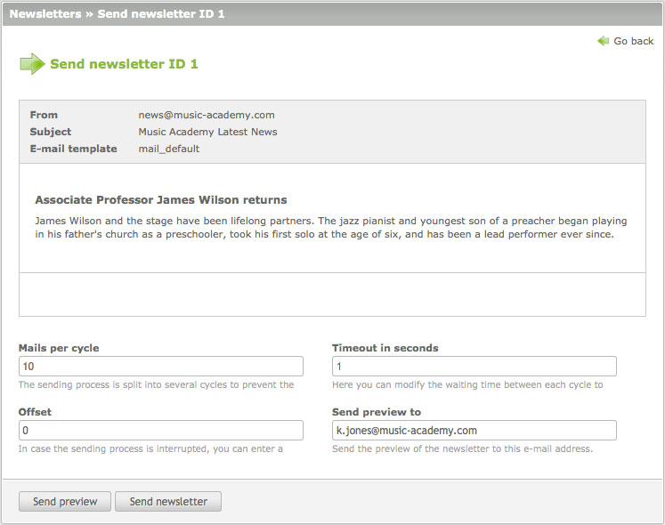

## ニュースレター

ニュースレターの機能を使用すると、ニュースレターの管理と送信、必要であればウェブサイトにニュースレターを表示できます。特定のページと関連付けられているアーティクルと違い、ニュースレターはチャンネルにまとめられていて、簡単にグループ化と分類ができます。


### 宛先

ニュースレターの購読は、それぞれのフロントエンドモジュールによって通常は処理するので、宛先を手作業で管理する必要はありません。データのプライバシーの理由で、Contaoは[二重のオプトイン][1]による購読の登録を必要とし、購読者の電子メールのアドレスだけ保管しています。



既に宛先のリストがある場合は、CSVファイルからContaoにインポートできます。


### 名前入りのニュースレター

ニュースレターを登録したメンバーに送信する場合には、「シンプルトークン」と呼ばれる方法で個人向けにカスタマイズできます。シンプルトークンは[挿入タグ][2]に似ていて、ニュースレターのHTMLとテキストのコンテンツ両方に使用できます。

```
Dear ##firstname## ##lastname##,

Please check and update your personal data:

Street: ##street##
Postal: ##postal##
City:   ##city##
Phone:  ##phone##
E-mail: ##email##

The Administrator
```

挿入タグと対照的に、シンプルトークンはメンバーのテーブル`tl_member`のデータを取り込むだけではなく、単純なif-else文を、例えば最初の挨拶の部分に指定できます。

```
{if gender=="male"}
Dear Mr ##lastname##,
{elseif gender=="female"}
Dear Mrs ##lastname##,
{else}
Dear Sirs,
{endif}

[newsletter content]

{if phone==""}
Please update your contact details and enter your phone number.
{endif}

The Administrator
```


### ニュースレターの送信

特に共有タイプのホスティングサービスでは、スクリプトの実行時間と1分に送信できる電子メールの数の両方、またはその一方について通常は制限されています。Contaoは両方の問題に、スクリプトの実行時間切れを防ぐために送信処理をいくつかの周期に分け、各周期の間に個別の待ち時間を加えて各周期の1分間の電子メールの数を制御する、といった方法で対処に努めています。




### フロントエンドモジュール

購読の処理と、ウェブサイトにニュースレーターを表示したい場合にフロントエンドモジュールを使用します。フロントエンドモジュールはバックエンドの"モジュール"から設定でき、ウェブサイトに実際に表示するためにはアーティクルかページレイアウトに追加しなければなりません。

<table>
<tr>
  <th>モジュール</th>
  <th>CSSのclass</th>
  <th>説明</th>
</tr>
<tr>
  <td>登録の申し込み</td>
  <td>mod_subscribe</td>
  <td>1つ以上のチャンネルの登録を申し込みできるフォームを生成します。</td>
</tr>
<tr>
  <td>解除の申し込み</td>
  <td>mod_unsubscribe</td>
  <td>1つ以上のチャンネルの解除を申し込みできるフォームを生成します。</td>
</tr>
<tr>
  <td>ニュースレターリスト</td>
  <td>mod_nl_list</td>
  <td>ニュースレターのリストをページに追加します。</td>
</tr>
<tr>
  <td>ニュースレターリーダー</td>
  <td>mod_nl_reader</td>
  <td>ニュースレターの詳細を表示します。</td>
</tr>
</table>


### 固定リンク

それぞれのニュースレターには、その参照に使用できる重複しないURL(固定リンク)があります:

```
http://www.example.com/newsletters/items/james-wilson-returns.html
```

上記のURLは"newsletters"というページから"james-wilson-returns"というニュースレターを要求します。Contaoはページに基づいたCMSであることを忘れないでください、"newsletters"というページが存在しなかったり、ニュースレターリーダーモジュールを含んでいなかったりするとニュースレターを表示しません。


[1]: http://en.wikipedia.org/wiki/Opt_in_e-mail
[2]: ../04-managing-content/insert-tags.md#insert-tags
