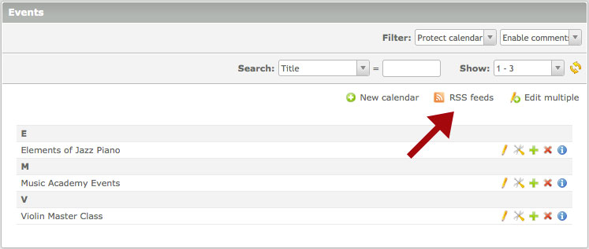
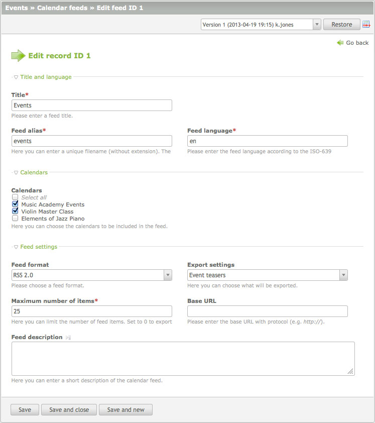

## RSS/Atomフィード

この機能はニュースアーカイブとカレンダーに使用できます。ここではカレンダーリストでの例です。




### 設定

1つ以上のカレンダーをグループにして、RSSやAtomのフィードに出力できます。ニュースアーカイブでも同様です。同時に、それぞれのイベントやニュースを、ティーザーだけか記事全体を出力するか選択できます。




### XMLファイル

XMLファイルは自動的にインストールしているContaoの```share```というディレクトリに生成します。ここでの例では次の様になります: ```share/events.xml```。
