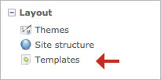

## テンプレート

テンプレートは主にHTMLとPHPのコードからできています。テンプレートはモジュールやコンテント要素等の内容の断片を構築するのに使用します。例えば、`news_full.html5`というテンプレートはニュース項目の完全な内容を表示するのに対して、`news_short.html5`というテンプレートはその内容の一部を表示します。

テンプレートは、そのモジュール独自の場所にあります。例えば、`news_full.html5`は`system/modules/news/templates/news`以下にあります。

このフォルダーのファイルを直接編集すると、次にContaoを更新したときに上書きされて、行った変更を**すべて失う***ことになります。これを避けるため、Contaoはテンプレートをバックエンドで変更できるようにしています。この場合、ファイルを複製して、Contaoの更新の間も保存されます。

新しくフォルダーを作成して、変更したいテンプレートを追加してください。その後で、[Theme components][1]の段落で説明しているように、フォルダーをテーマに忘れずに追加してください。

テンプレートはモジュール、コンテント要素、フォーム等の構造の一部のいずれでもあるため、接頭文字列があります。テンプレートは簡単にグループ化され、順序付けされ、認識されます。例えば、`j_`は"jQuery"を意味し、`nl_`は"newsletter"を意味します。

[1]: ../03-managing-pages/themes.md#theme-components
