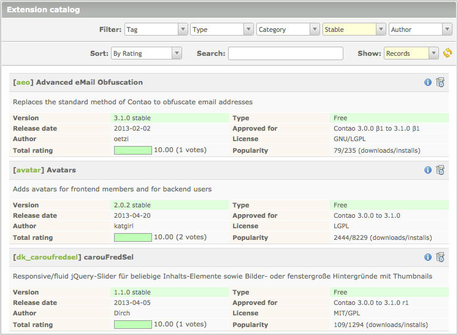
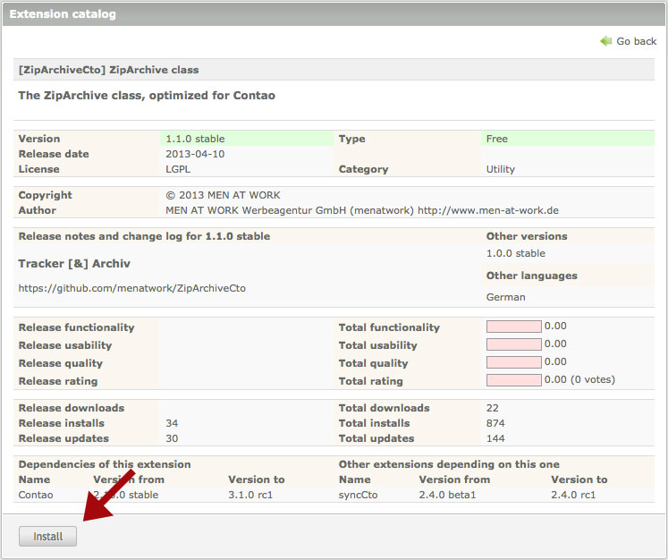
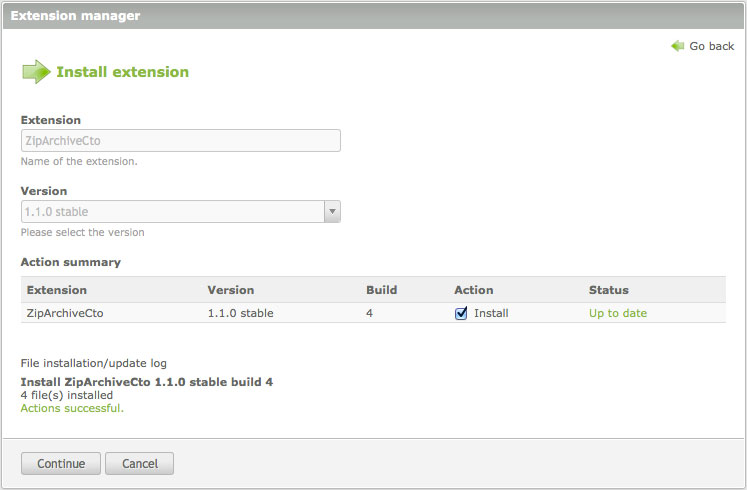
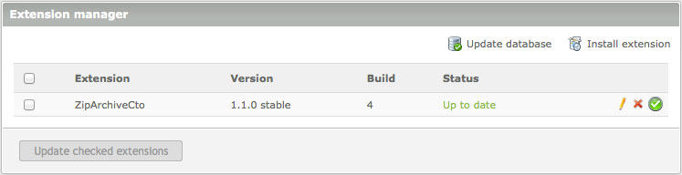
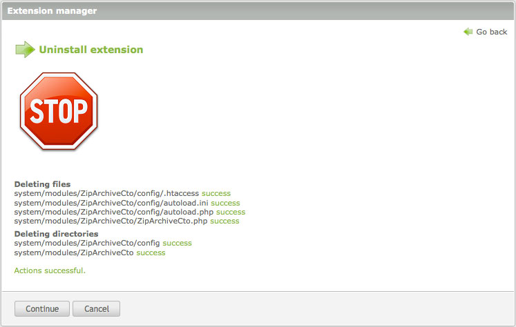

## 機能拡張

機能拡張によって追加の機能性をContaoに追加できるので、Contaoには欠かせない部分と言えます。1400の機能拡張を、Contao機能拡張リポジトリから利用可能でバックエンドから直接閲覧できます。リポジトリのサーバーとの間の通信はSOAPによって行っているため、サービスを利用するにはPHPのSOAP拡張を(初期状態で有効でないなら)有効にしなければなりません。

### 機能拡張カタログ

"機能拡張カタログ"のモジュールを使用すると機能拡張のリストの閲覧と、ボタンを押して機能拡張をインストールできます。特定の機能拡張を探すには、フィルターと並べ替えのオプションを使用し、アイコンか機能拡張の名前をクリックして詳細なページを開いて、モジュールをインストールしてください。

詳細なページには機能拡張の説明と、システムの必要条件、バージョン、他のモジュールの依存関係といった詳細な情報があります。ダウンロードと機能拡張をインストールするには"インストール"のボタンをクリックしてください。

Contaoは自動的に機能拡張のダウンロードとインストールを行い、必要であればデータベースを更新します。

### 機能拡張管理

"機能拡張管理"のモジュールから機能拡張の更新とアンインストールを行えます。自動的に更新がないか確認して、新しいバージョンがあれば通知します。多数の機能拡張にはオンラインマニュアルとサポートを受けられるフォーラムのスレッドの両方、またはその一方のリンクがあります。

機能拡張をアンインストールするには、単にアンインストールのアイコンをクリックして指示に従ってください。機能拡張管理はすべてのファイルとフォルダーを削除して、必要ならデータベースを更新します。この動作は取り消せず、テーブルも回復できないことに注意してください!

### 手作業によるインストール

PHPのSOAP拡張がサーバーで利用できない場合、Contaoの機能拡張を手作業でインストールすることもできます。[機能拡張のリスト][1]から個別のモジュールを探して最新のリリースの.zipアーカイブをダウンロードしてください。それからファイルを展開して、展開したファイルをローカルまたはリモートのContaoのディレクトリにコピーしてください。最後に[Contaoインストールツール][2]でデータベースを確認してください。

[1]: https://contao.org/en/extension-list.html
[2]: ../01-installation/installing-contao.md#the-contao-install-tool
