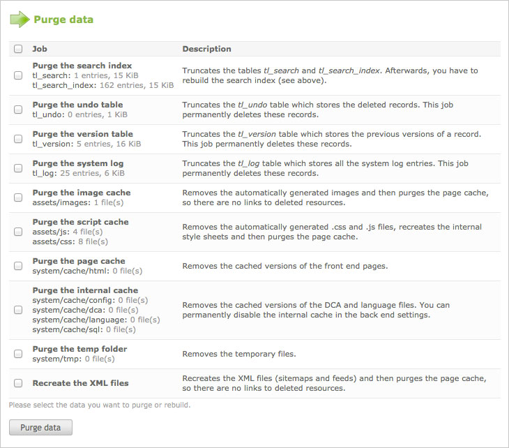

## 保守

Contaoの保守作業のほとんどは定期的なコマンドスケジューラーによって定期的に実行されますから、実際の作業に集中できます。保守モジュールの仕事さえも自動的に実行されますが、時々はそれらを手作業で起動することも必要でしょう。

### データの消去

ユーザーが生成したコンテンツに加えてContaoは様々なシステムのデータを保持していて、削除したレコードの復元したり、以前のバージョンに戻したり、ウェブサイトを検索したり、ページの読み込み時間を減らしたり、といったことに使用しています。このデータは手作業で消去でき、例えば画像キャッシュから古いサムネイルの削除や、サイト構造を修正した跡でXMLのサイトマップを再作成を行えます。

### 検索インデックスの再構築

ページはフロントエンドで表示されるときに(同時にバックエンドにログインしていなければ)、ページは通常は自動的に検索インデックスに追加されますので、検索インデックスについて心配する必要はありません。しかし、多数のページを変更した場合、ブラウザーでページを1つずつ表示する代わりに、一度に更新できた方が便利です。この場合、検索インデックスを手作業で再構築できます。

