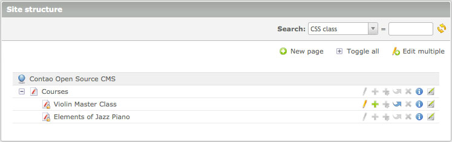
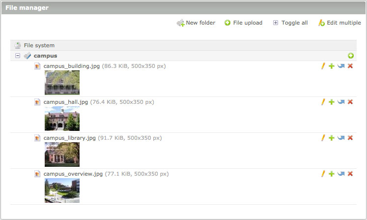
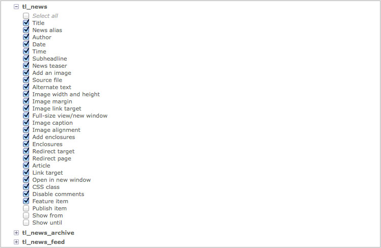

## ユーザーとグループ

Contaoは管理領域にログインできるバックエンドのユーザー("ユーザー")と、ウェブサイトにログインできるフロントエンドのユーザー("メンバー")を区別しています。管理者が初期設定ですべてのページと要素をアクセスできる("すべて許可")一方、通常ユーザーはそのプロフィールまたは所属するグループの1つのプロフィールで明示的に許可を受けていないリソースにはアクセスできません("すべて拒否")。

### ユーザー

それぞれのユーザーに複数のグループを関連付けることができて、関連付けたグループの権限を自動的に継承します。すべての権限は追加的で、所属するグループの権限の総和を継承することを意味します。グループAがある権利を与えている場合に、グループBで取り消すことはできません。

#### ページマウント

ページマウントは、ユーザーに見ることを許可するサイト構造のページを設定します。下の画面の例は、Helen Lewisさんが見るサイト構造です。ウェブサイトにはさらに多数のページがありますが、彼女は3つのページだけ見ることができます。これは、"Editors"グループの設定で"Course"のページだけがページマウントされているからです。Helen Lewisさんは3つのページを見ることができますが、その中の1つだけ編集できることに注意してください!

ページを見えることに、そのページ(や、そのアーティクル)を編集する権利を含みません。サイト構造で[ページの権限][1]を設定することを覚えておいてください。ページをユーザーに許可するには、そのユーザーのプロフィールでページをマウントして、サイト構造でアクセス権を与えなければなりません。

#### ファイルマウント

ページマウントと同様に、ファイルマウントはユーザーが見ることを許可するフォルダーを設定します。下の画面の例はHelen Lewisさんが見るファイル管理です。彼女は"campus"のフォルダーだけ見ることができますが、管理者はファイルディレクトリ(`files`)全体を見ることができます。

#### 許可する項目

最初に説明しましたように、通常のユーザーは初期状態で権限をまったく持っていません("すべて拒否")が、これはフォームのどの欄にもアクセスできないという意味も含みます。例えばニュースのモジュールにアクセスを許可したとしても、新しい項目を作成するフォームは、管理者がグループの設定で`tl_news`テーブルの1つ以上の項目を有効にするまで空のままとなります。

### メンバー

メンバー(フロントエンドのユーザー)の管理は、ページマウントや許可する項目がないためバックエンドのユーザーの管理よりもずっと簡単です。メンバーの管理は主に保護したページのアクセス制御に必要で、グループの段階で実現されています。ウェブサイトの構成に依存して、登録済みのメンバーはゲストが利用できない保護したページやアクセス保護されたダウンロードを見ることができます。

[1]: ../03-managing-pages/modules.md#access-control
