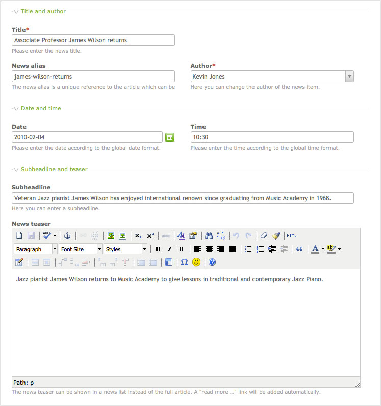

## パレット

パレットは、レコードを編集するのに必要なフォームの項目のグループです。
通常、パレットはテーブルのすべての列ではなく、特定のモジュールやコンテント要素に属する列だけを含みます。パレットはユーザーの権限や要素の種類に依存して動的に変更でき、(サブパレットと呼ばれる)フォームのある部分をAjaxを介して対話的に読み込めます。


### グループの定義

パレットは、セミコロン(;)またはコンマ(,)で項目を連結した文字列です。コンマは項目の名前を単に区切るために使用し、一方でセミコロンは展開と折り畳みができる新しいフィールドセットの開始を示します。



上記の例は以下のコードで定義しています:

```php
{title_legend},headline,alias,author;{date_legend},date,time;{teaser_legend:hide},subheadline,teaser
```

`title_legend`と`date_legend`といったプレースホルダーは、"TL_LANG"という配列の対応するラベルに置き換えらます。

```php
$GLOBALS['TL_LANG']['tl_news']['title_legend'] = 'Title and author';
$GLOBALS['TL_LANG']['tl_news']['date_legend']  = 'Date and time';
```


### 項目の配置

Contaoのバックエンドは単純な2列のグリッドシステムを使用して、グループ内に入力項目を配置します。データコンテナ配列の評価のセクションで、`tl_class`に以下のCSSのクラスを適用できます。(例: 'tl_class'=>'w50 wizard')

<table>
<tr>
  <th>tl_class</th>
  <th>説明</th>
</tr>
<tr>
  <td>w50</td>
  <td>項目の幅を50%にしてフロート(<code>float: left</code>)にします。</td>
</tr>
<tr>
  <td>clr</td>
  <td>すべてのfloatをクリア(<code>clear:both</code>)します。</td>
</tr>
<tr>
  <td>wizard</td>
  <td>入力項目を短くして、ウィザードのボタンに十分な場所を用意します。(例: 日付選択の項目)</td>
</tr>
<tr>
  <td>long</td>
  <td>テキスト入力を2列の幅にします。</td>
</tr>
<tr>
  <td>m12</td>
  <td>要素に12ピクセルのトップマージンを追加します。(単一のチェックボックスで使用)</td>
</tr>
</table>
