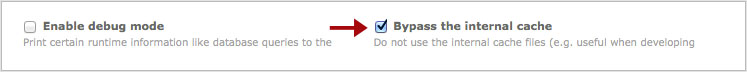

## 内部のキャッシュを無視

Contaoの機能拡張を開発する前に、内部のキャッシュを無視する設定にした方が良いでしょう。内部のキャッシュを無視する場合は、「システム」→ 「設定」と操作して「全体的な構成」にある「内部のキャッシュを無視」のチェックボックスを選択してください。

サイトを実運用に移行した場合は直ちに「内部のキャッシュを無視」のチェックボックスの選択を外して応答時間を最小にしてください。
