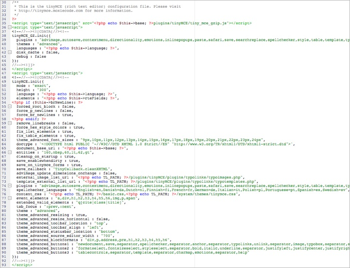

## TinyMCEのカスタマイズ

このページではリッチテキストエディターのカスタマイズして、Contaoの次の更新で上書きされないように変更を保存する方法を説明しています。Contaoは初期状態ではTinyMCEのプラグインをすべては取り込んでいないことに注意してください。このためContaoの配布に含まれていない、あるプラグインを使用したい場合は[TinyMCEのプロジェクトのウェブサイト][1]からダウンロードして`plugins/tinyMCE/plugins`というフォルダーに移してください。



上の画像はリッチテキストエディターの構成ファイル`system/config/tinyMCE.php`の初期状態の内容です。構成をカスタマイズするファイルを作成するには、単純にこれをコピーして名前を変更、例えば`tinyCustom.php`とします。次に、この新しいファイルを変更して保存します。最後の段階として、`system/config/dcaconfig.php`というファイルで[[データコンテナ構成][2]を調整して、Contaoにカスタマイズしたファイルを適用する項目を指定します。


```php
// テキストのコンテント要素に独自のリッチテキストエディタの構成を使用します。
$GLOBALS['TL_DCA']['tl_content']['fields']['text']['eval']['rte'] =
'tinyCustom';
```


[1]: http://tinymce.moxiecode.com
[2]: ../07-customizing-contao/custom-configurations.md#customizing-the-data-container-configuration
