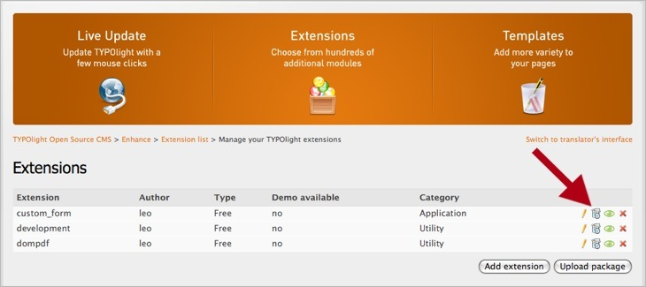

## リリースの追加

機能拡張を新しく作成した後で、最初のリリースを追加できます。機能拡張の新しいバージョンは、それぞれ別のリリースとして保持します。ナビゲーションの対応したアイコンからリリースの管理を開いて"Add release"のボタンをクリックしてください。

機能拡張リポジトリでバージョン番号は、メジャー、マイナー、保守のバージョンを示す3つの数値の部分(例: `1.0.0`)と、テキストによる開発の状態(例: `beta1`)の構成となっています。

<table>
<tr>
  <th>状態</th>
  <th>説明</th>
</tr>
<tr>
  <td>alpha1 - alpha3</td>
  <td>アルファ版であることを示します。</td>
</tr>
<tr>
  <td>beta1 - beta3</td>
  <td>ベータ版であることを示します。</td>
</tr>
<tr>
  <td>rc1 - rc3</td>
  <td>リリース候補であることを示します。</td>
</tr>
<tr>
  <td>stable</td>
  <td>実運用のシステム向けの安定リリースであることを示します。</td>
</tr>
</table>
