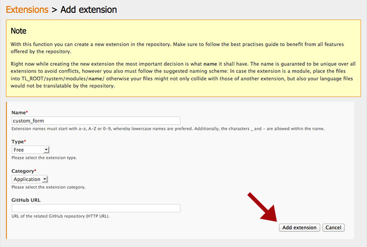

## 機能拡張の追加

新しい機能拡張を追加するには、"Manage extensions"のリンクに続けて、"Add extension"のボタンをクリックします。 機能拡張の詳細を入力できるフォームに移動します。上部の黄色いボックスは命名規則についての重要な情報を含んでいますので、注意深く読まなければなりません。

以下は現在利用できるカテゴリです。

<table>
<tr>
  <th>カテゴリ</th>
  <th>説明</th>
</tr>
<tr>
  <td>アプリケーション</td>
  <td>この機能拡張は自律したアプリケーションです。</td>
</tr>
<tr>
  <td>プラグイン</td>
  <td>この機能拡張はPHPまたはJavaScriptのライブラリです。</td>
</tr>
<tr>
  <td>テーマ</td>
  <td>この機能拡張はバックエンド用のテーマです。</td>
</tr>
<tr>
  <td>ユーティリティ</td>
  <td>この機能拡張はバックエンドのためのユーティリティプログラムです。</td>
</tr>
<tr>
  <td>ウィジェット</td>
  <td>この機能拡張はフォームウィジェットです。</td>
</tr>
<tr>
  <td>翻訳</td>
  <td>この機能拡張はContaoのバージョン用の翻訳です。</td>
</tr>
<tr>
  <td>バンドル</td>
  <td>同時にインストールできる機能拡張の集合です。</td>
</tr>
<tr>
  <td>その他</td>
  <td>この機能拡張は以上のいずれのカテゴリにもあてはまりません。</td>
</tr>
</table>
