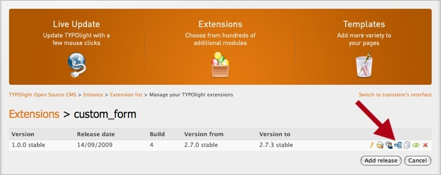

## 依存関係の追加

公開しようとしている機能拡張は他の機能拡張の機能、例えばcronジョブを使用しているかもしれません。このような機能拡張を動作させるにはcron機能拡張、通常は依存関係として参照される機能拡張のインストールが必要となります。これらの依存関係を機能拡張リポジトリに保存できて、特定の機能拡張をインストールする時に必要なモジュールをすべて自動的にインストールできます。

まず、依存関係として加えたい機能拡張を選択し、"Continue"のボタンをクリックして選択を確認します。次に、機能拡張が動作するとわかっている最小と最大のバージョンを選択します。
