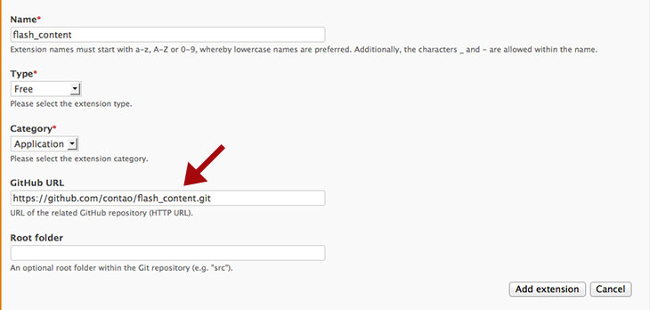
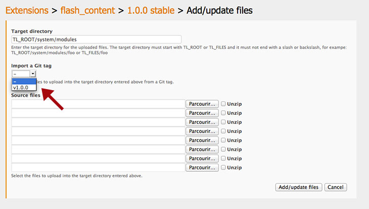

## GitHubリポジトリからのファイルの追加

GitHubのリポジトリからファイルを取り込むこともでき、そのためにはリリースにタグを付けてGitHubの中央リポジトリにタグをプッシュしていなければなりません。

設定でGitHubのリポジトリにHTTPSのURLを入力してください。

リポジトリのルートのフォルダーの名前も指定できます。この場合、このルートのフォルダー以外のファイルやフォルダーは取り込む際に対象にしません。

タグを選択した場合、そのファイルを自動的にダウンロードして、手作業でアップロードしたときとまったく同じように利用可能な状態になります。

