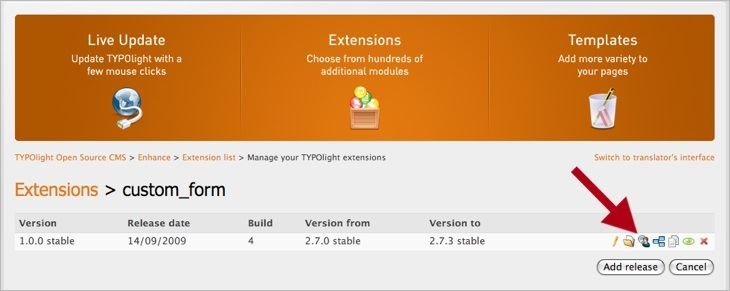
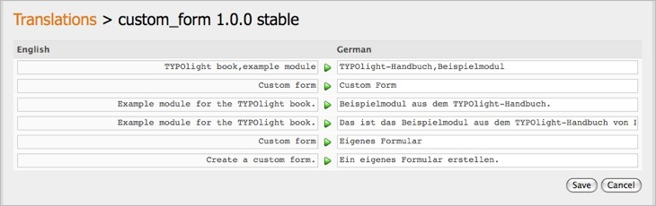

## 翻訳の追加

機能拡張を公開する前に、少なくとも翻訳を1つ作成しなければなりません。翻訳管理を開いて、"Add language"のボタンをクリックします。常に英語の翻訳を作成することが望ましいです、なぜなら通常のバックエンドのユーザーには、ユーザーの言語と(代替の言語の)英語で利用可能な機能拡張だけが機能拡張管理に表示されるからです。

完了した翻訳は対応するナビゲーションのアイコンをクリックして公開できます。
