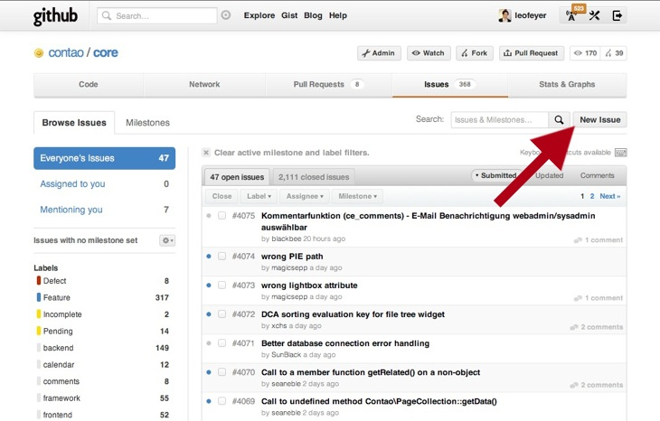

## 新しいissueの作成

まず始めに、新しいチケットを作成するにはログインしなければならないことに注意してください。[GitHubの登録][2]は無償です。あなたのアカウントでログインしたら、メインのナビゲーションにある"New issue"をクリックしてください。

常に考えられる問題を詳細に記述して、オンラインのデモや開発環境で再現する方法を知らせてください。問題がインストールしたContaoだけで発生してオンラインのデモでは起きない場合は[フォーラム][3]をご覧ください。

[1]: https://github.com/signup/free
[2]: https://community.contao.org/en/
